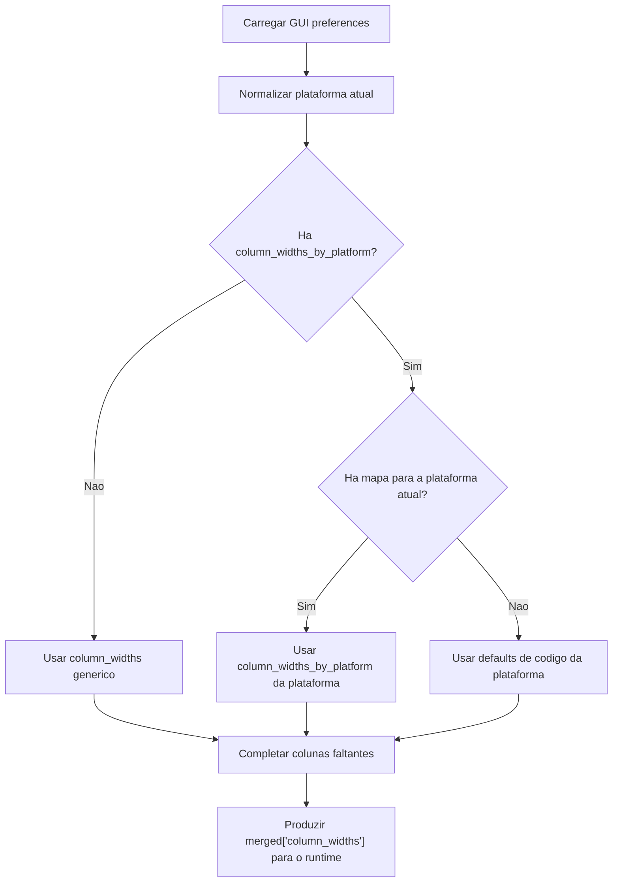

# Column Widths By Platform

## Objetivo

Registrar de forma objetiva como a GUI resolve larguras de coluna por sistema operacional.

Hoje a decisao e esta:
1. `darwin` usa o mapa novo ajustado para macOS.
2. `win32` usa o mapa novo ajustado para Windows.
3. `linux` tem bloco proprio e preserva o baseline antigo.
4. `column_widths` simples continua existindo como fallback de compatibilidade.

## Onde o SO e detectado

A deteccao do sistema operacional acontece em:
- `gui/gui_config.py:284`

Funcao:
- `_normalize_platform_key(platform_name: str | None = None) -> str`

Regra:
1. Se `platform_name` vier preenchido, usa esse valor.
2. Senao, usa `sys.platform`.
3. Normaliza para tres chaves internas:
   - `darwin`
   - `win32`
   - `linux`

Trecho de decisao:
1. `win*` -> `win32`
2. `darwin` -> `darwin`
3. qualquer outro -> `linux`

## Onde isso dispara a escolha dos widths

A resolucao do mapa efetivo acontece em:
- `gui/gui_config.py:305`

Funcao:
- `_resolve_platform_column_widths(...)`

Essa funcao:
1. chama `_normalize_platform_key(...)`
2. escolhe o bloco em `DEFAULT_COLUMN_WIDTHS_BY_PLATFORM`
3. aplica fallback para `linux` se a chave nao existir
4. opcionalmente sobrepoe `fallback_widths`

Depois, no merge do config carregado, a escolha do mapa runtime acontece em:
- `gui/gui_config.py:524`
- `gui/gui_config.py:545`

Fluxo:
1. copia `DEFAULT_COLUMN_WIDTHS_BY_PLATFORM`
2. le `loaded_config["column_widths_by_platform"]`, se existir
3. saneia cada mapa por plataforma
4. grava isso em `merged["column_widths_by_platform"]`
5. resolve `merged["column_widths"]` para a plataforma atual

Ou seja:
- a deteccao do SO acontece no proprio `gui_config.py`
- a escolha do mapa runtime tambem acontece no proprio `gui_config.py`
- isso e intencional, porque esse arquivo nao e so "dados"; ele ja e o loader/merger de configuracao da GUI

## Algoritmo

Resumo do algoritmo:
1. carregar defaults de codigo por plataforma
2. carregar o JSON, se existir
3. se houver `column_widths_by_platform`, usar esse bloco como fonte principal por plataforma
4. se nao houver `column_widths_by_platform`, usar `column_widths` simples como fallback de compatibilidade
5. escolher a plataforma atual com `_normalize_platform_key(...)`
6. produzir `merged["column_widths"]` final para o runtime

Pseudo fluxo:
1. detectar plataforma atual
2. verificar se o config possui mapa por plataforma
3. se sim, usar o mapa da plataforma atual
4. se nao, usar `column_widths` simples
5. completar larguras faltantes com defaults de codigo

## Diagrama Mermaid (codigo)

## Diagrama Mermaid (renderizado)

## Mapa atual por plataforma

### darwin
1. `descricao_ssa`: `340`
2. `solicitante`: `150`
3. `descricao_execucao`: `330`
4. `grau_prioridade_emissao`: `96`
5. `grau_prioridade_planejamento`: `98`
6. `semana_programada`: `72`
7. `semana_cadastro`: `60`
8. `semana_executada`: `60`
9. `total_de_reprogramacoes`: `82`
10. `execucao_parcial`: `78`

### win32
1. `descricao_ssa`: `340`
2. `solicitante`: `150`
3. `descricao_execucao`: `330`
4. `grau_prioridade_emissao`: `96`
5. `grau_prioridade_planejamento`: `98`
6. `semana_programada`: `72`
7. `semana_cadastro`: `74`
8. `semana_executada`: `60`
9. `total_de_reprogramacoes`: `82`
10. `execucao_parcial`: `78`

### linux
1. `descricao_ssa`: `298`
2. `solicitante`: `123`
3. `descricao_execucao`: `282`
4. `grau_prioridade_emissao`: `122`
5. `grau_prioridade_planejamento`: `122`
6. `semana_programada`: `88`
7. `semana_cadastro`: `74`
8. `semana_executada`: `96`
9. `total_de_reprogramacoes`: `130`
10. `execucao_parcial`: `130`

## Custo e motivo da solucao

Custo da solucao atual:
1. baixo
2. sem refatoracao transversal
3. sem mexer no layout
4. mantendo compatibilidade com configs antigos

Motivo de manter a deteccao no `gui_config.py`:
1. e ali que o loader da GUI ja faz merge de defaults e config carregado
2. a decisao de widths e parte do contrato de configuracao da GUI
3. manter a resolucao perto do merge evita espalhar fallback pela aplicacao
4. o merge tambem consegue migrar widths legados gerenciados sem reescrever o arquivo efetivo do usuario

## Ponto de extensao futura

Para ajustar Linux no futuro, basta alterar:
- `DEFAULT_COLUMN_WIDTHS_LINUX`
- ou o bloco `column_widths_by_platform["linux"]` no arquivo de configuracao

Nao e necessario reabrir o algoritmo.
