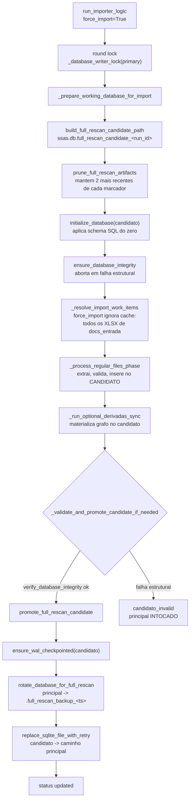
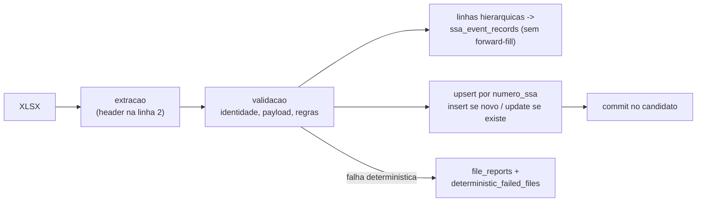
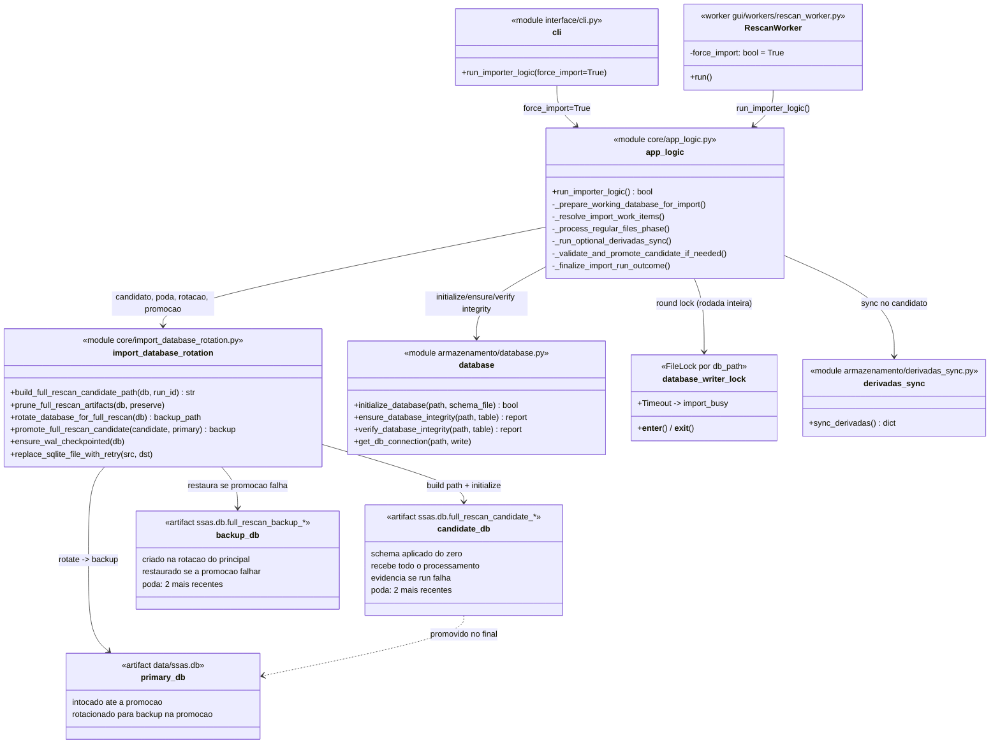

# Criacao do Banco de Dados do Zero (Full Rescan)

Documento do processo de construcao/reconstrucao completa do
`data/ssas.db` a partir das planilhas em `docs_entrada/` — o caminho
"schema-first, promove ao final" implementado em `core/app_logic.py`.

## Quando acontece

O full rescan e ativado por `run_importer_logic(force_import=True)`:

- CLI: `interface/cli.py` chama `run_importer_logic(force_import=True)`
  no caminho de rescan.
- GUI: `gui/workers/rescan_worker.py` tem `force_import=True` como
  default do `RescanWorker` (rescan completo pela interface).
- Nao ha import automatico no startup — a criacao do zero e sempre
  acao explicita do usuario.

Diferenca para o modo diff (`force_import=False`): o diff escreve
direto no banco principal e pula arquivos ja processados via
`file_cache.json`; o full rescan **ignora o cache**, processa tudo em um
**banco candidato isolado** e so toca o principal na promocao final.

## Visao geral



## Passo a passo

### 1. Round lock

```python
_round_lock_cm = _database_writer_lock(primary_db_path)
_round_lock_cm.__enter__()   # Timeout -> "import_busy"
```

O lock cobre a rodada inteira: um segundo import no mesmo banco recebe
`status: import_busy / primary_locked_by_another_run` em vez de correr a
janela de promocao. O FileLock singleton torna os locks internos por
conexao reentrantes.

### 2. Banco candidato isolado

```python
candidate_db_path = _build_full_rescan_candidate_path(primary_db_path, run_id)
# -> data/ssas.db.full_rescan_candidate_20260916_xxxxxx_xxxxxx
working_db_path = candidate_db_path
_prune_full_rescan_artifacts(primary_db_path, preserve=candidate_db_path)
initialize_database(working_db_path)   # schema do zero
```

- Todo o processamento escreve **somente no candidato**. O principal fica
  disponivel para leitura durante toda a rodada.
- `prune_full_rescan_artifacts` roda dentro do lock e mantem os 2
  artefatos mais recentes de `full_rescan_candidate_*` e
  `full_rescan_backup_*` (com sidecars) como evidencia — o candidato da
  rodada corrente e protegido por `preserve=`.
- `initialize_database` aplica o arquivo `.sql` de schema (resolvido por
  caminho absoluto, relativo ao CWD ou `config/` do projeto).

### 3. Verificacao de integridade pre-import

`ensure_database_integrity(working_db_path)` valida o candidato antes de
aceitar trabalho:

| Verificacao | Falha estrutural? |
|---|---|
| `database_accessible` | aborta (`DatabaseConnectionError`) |
| `table_exists`, `schema_valid` | aborta (`DatabaseSchemaError`) |
| `disk_space_sufficient` | aborta (`DatabaseSpaceError`) |
| `data_consistent` | **nao aborta** — a importacao e o mecanismo de correcao; so loga warning |

### 4. Resolucao dos arquivos (cache ignorado)

Em `force_import`, `_resolve_import_work_items` chama
`_get_files_to_process(..., force_import=True)` — todo XLSX elegivel de
`docs_entrada` entra, independente do `file_cache.json`.

Politicas forcadas no full rescan:

- `ignore_nosurvivor_in_full_rescan` — subdir `nosurvivor/` e excluido a
  forca (snapshots que nao devem reviver).
- `move_processed_after_import` — desativado a forca (nada e movido
  durante a reconstrucao).
- `include_processadas_in_full_rescan` — quando configurado, inclui o
  subdir `processadas/` na varredura.
- Planilhas `.xls` legadas sao ignoradas com warning.
- Planilhas especiais de derivadas (`_is_derivadas_sheet_file`) entram
  numa fase dedicada de sync, nao no insert regular.

### 5. Processamento por arquivo (no candidato)

`_process_regular_files_phase` executa, por arquivo e em ordem
deterministica (snapshot mais antigo primeiro, mais novo por ultimo):



Cancelamento no meio da fase (`cancelled_full_rescan`): o principal
nunca foi tocado — o candidato fica no disco como evidencia e o run
termina `cancelled_partial / full_rescan_cancelled_before_final_promotion`.

### 6. Sync de derivadas (no candidato)

`_run_optional_derivadas_sync` roda o `sync_derivadas` sobre o candidato:

- Fonte gerenciada: `ssa_table.derivada_de` (`db_field`).
- Planilhas especiais de derivadas somam uma fase extra (`sheet_files`).
- Materializa `ssa_derivada_source`, `_matrix`, `_closure`, `_summary` e
  grava auditoria em `ssa_derivada_sync_run`.
- Erro bloqueante de derivadas aborta antes da promocao:
  `derivadas_sync_error / blocking_derivadas_sync_error` — dados ja
  importados ficam no candidato (preservado como evidencia), cache nao e
  atualizado, proximo rescan refaz o sync.

### 7. Validacao final e promocao

`_validate_and_promote_candidate_if_needed`:

1. `verify_database_integrity(candidato)` — checks estruturais:
   `database_accessible`, `table_exists`, `schema_valid`,
   `sqlite_integrity_ok`, `file_permissions_ok`.
2. Falha estrutural → `candidate_invalid /
   candidate_failed_final_integrity`, principal intocado.
3. Inconsistencias de **dados** (status fora de catalogo, datas) nao
   impedem a promocao — o candidato e o estado mais correto disponivel.
4. `promote_full_rescan_candidate`:

```mermaid
sequenceDiagram
    participant C as DB candidato
    participant P as ssas.db (principal)
    participant B as backup .full_rescan_backup_&lt;ts&gt;

    Note over C: ensure_wal_checkpointed<br/>(WAL ativo bloqueia a promocao)
    P->>B: rotate_database_for_full_rescan<br/>(checkpoint + rename do principal)
    C->>P: replace_sqlite_file_with_retry
    alt promocao falha (OSError)
        B->>P: restaura backup no caminho principal
        Note over P: erro: falha ao promover;<br/>backup restaurado
    end
```

- Backup do principal anterior: `ssas.db.full_rescan_backup_<ts>`.
- Se o principal nao existia (primeiro build de verdade), `backup_path` e
  `None` — o candidato e promovido para um caminho vazio.
- `-journal` preexistente entra na rotacao junto: um rollback journal
  quente do banco antigo nao pode ficar no caminho — apos a promocao o
  SQLite o aplicaria sobre o banco novo.

### 8. Finalizacao

`_finalize_import_run_outcome` consolida status/razao, grava
`logs/import_run_<run_id>.json` e registra o outcome
(`import_outcome.record_import_outcome`). `actually_changed` e verdadeiro
quando houve promocao (backup_path presente ou candidato promovido sobre
caminho vazio).

## Artefatos gerados em `data/`

| Artefato | Quando | Destino |
|---|---|---|
| `ssas.db.full_rescan_candidate_<run_id>` | toda rodada full | promovido em sucesso; **preservado como evidencia** em falha/cancelamento |
| `ssas.db.full_rescan_backup_<ts>` | promocao com principal existente | evidencia; podado para 2 mais recentes |
| `historico_backups/ssas.db.integrity_*` | snapshot de integridade | podado (`INTEGRITY_SNAPSHOT_MAX_COUNT=2`) |
| `logs/import_run_<run_id>.json` | toda rodada | relatorio completo (durations, counts, paths, status) |
| `file_cache.json` | pos-sucesso | marcacao sha256/size/mtime dos arquivos processados |

A poda de candidatos/backups (`prune_full_rescan_artifacts`) limita o
espaco: sem ela cada full rescan deixava ~140 MB de evidencia para
sempre. Mantem os 2 mais recentes de cada marcador; sidecars sao
removidos antes do principal e orfaos de sidecar sao varridos.

## Casos de borda cobertos pelo design

| Cenario | Comportamento |
|---|---|
| Primeiro build (sem ssas.db) | candidato promovido para caminho vazio; sem backup |
| Falha estrutural no candidato | promocao abortada; principal intocado; candidato = evidencia |
| Cancelamento no meio | principal intocado; candidato = evidencia; `cancelled_partial` |
| Crash do processo | candidato orfao fica como evidencia; poda o limita a 2 |
| Dois rescans simultaneos | segundo recebe `import_busy` no round lock |
| WAL ativo no candidato | promocao bloqueada (evita banco inconsistente) |
| Falha na promocao | backup restaurado automaticamente |
| Erro bloqueante de derivadas | aborta antes da promocao; cache nao atualizado |
| `.xls` legado | ignorado com warning |
| Subdir `nosurvivor/` | excluido a forca no full rescan |

## Diagrama de classes (UML)

Versao editavel em draw.io: `docs/diagrams/criacao_db_do_zero_classes.drawio`.



## Codigo-fonte

| Papel | Arquivo |
|---|---|
| Orquestracao | `core/app_logic.py` (`run_importer_logic`) |
| Preparacao do candidato | `core/app_logic.py` (`_prepare_working_database_for_import`) |
| Resolucao de arquivos | `core/app_logic.py` (`_resolve_import_work_items`) |
| Fase de processamento | `core/app_logic.py` (`_process_regular_files_phase`) |
| Validacao + promocao | `core/app_logic.py` (`_validate_and_promote_candidate_if_needed`) |
| Rotacao/promocao/poda | `core/import_database_rotation.py` |
| Schema do zero | `armazenamento/database.py` (`initialize_database`) |
| Sync de derivadas | `armazenamento/derivadas_sync.py` |
| Trigger CLI | `interface/cli.py` (`force_import=True`) |
| Trigger GUI | `gui/workers/rescan_worker.py` (`force_import` default True) |
