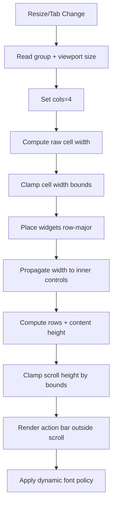

# Filter Tab Optimizations - January 2026

Current release baseline reference: `v4.42`.
Runtime command standard for validations: `uv run --python 3.13 ...` (fallback 3.12 -> 3.11 -> 3.10).

## v4.22 - Dynamic 4-Column Layout Algorithm (Current)

This section documents the current algorithm used by Advanced Filters in PyQt6.
It is the active baseline. Older notes remain below for historical reference.

### Goals
- Keep 4 columns visible in Advanced Filters.
- Prevent oversized controls from dominating rows.
- Keep bottom action bar visible and readable.
- Avoid clipping of last row and avoid dead space.
- Keep behavior deterministic on resize.

### Inputs
- `group_width`: outer width of Advanced Filters group.
- `viewport_width`: effective width from scroll viewport.
- `group_height`: current group height.
- Layout constants:
  - `LAYOUT_GRID_MIN_COLS = 4`
  - `LAYOUT_GRID_MAX_COLS = 4`
  - `LAYOUT_ADV_CONTROL_HEIGHT`
  - `LAYOUT_ADV_FIELD_BOX_MIN_HEIGHT / MAX_HEIGHT`
  - `LAYOUT_ADV_PANEL_MIN_HEIGHT / MAX_HEIGHT`

### Core Flow
1. Resolve effective width:
   - `effective_width = min(group_width, viewport_width_if_available)`.
2. Resolve columns:
   - fixed policy, always `cols = 4`.
3. Compute cell capacity:
   - subtract horizontal margins and spacing.
   - derive `raw_cell_width`.
   - clamp to bounded width range to avoid giant controls.
4. Place widgets:
   - fill grid in deterministic order, row-major.
   - each field box gets `max_width = capped_cell_width`.
   - internal controls (`QToolButton`, `QComboBox`) inherit capped limits.
5. Compute vertical size:
   - `rows = ceil(visible_widgets / cols)`.
   - `content_h = rows * field_box_max_h + spacing + margins`.
   - clamp scroll area height to `[panel_min_h, panel_max_h]` and available group height.
6. Action bar handling:
   - action bar (`Aplicar`, `Limpar`) stays outside field scroll.
   - anchored right, always visible.
7. Dynamic font policy:
   - apply compact or normal font tier based on `effective_width`.
   - apply to titles and controls with lower/upper bounds.

### Deterministic Ordering
The render order is fixed:
1. `Emissor`
2. `Executor`
3. `Situacao`
4. `Ano Emissao`
5. `Ano Execucao`
6. `Reprogramacoes`
7. `Prio. Emissao`
8. `Prio. Planejamento`
9. `Macro`
10. `Derivadas`
11. `Emissao (AnoSemana)`
12. `Execucao (AnoSemana)`
13. `Solicitante`
14. `Resp Prog`
15. `Resp Exec`

### ASCII Diagram

```text
+---------------------------------------------------------------+
| Advanced Filters Group                                        |
|  +---------------------------------------------------------+  |
|  | Scroll Viewport (fields only)                           |  |
|  |  [c1] [c2] [c3] [c4]                                    |  |
|  |  [c1] [c2] [c3] [c4]                                    |  |
|  |  [c1] [c2] [c3] [c4]                                    |  |
|  |  [c1] [c2] [c3] [ ]                                     |  |
|  +---------------------------------------------------------+  |
|                                   [Aplicar] [Limpar]          |
+---------------------------------------------------------------+
```

### Mermaid Diagram



### Guardrails
- Never put action bar inside the field scroll.
- Never let one control define full-row width.
- Never hide last row due to aggressive max-height.
- Keep column count deterministic when policy is fixed.

### Known tradeoff
- Fixed 4-column policy improves predictability but increases compactness pressure on small heights.
- Mitigation: bounded font tiers and bounded control widths.

### v4.22 lock points (new)
- Column-filter panel defaults are always restored after clear-all.
- Add-column menu uses full candidate set and excludes legacy ghost aliases.
- Apply/Hide controls remain present in default visible rows.

## Executive Summary

Significant optimizations implemented in Filter tab for improved performance and usability, reducing load time by ~40-60% and eliminating UI blocking during interactions.

## Identified Problems

### 1. Performance
- Full rebuild of 14+ menus sequentially on each refresh
- apply() operations that could be vectorized
- Multiple redundant operations (tolist() + set() + sorted())
- Refresh triggered on every checkbox click (no debouncing)
- Monolithic cache (all-or-nothing invalidation)

### 2. Functionality
- Missing granular control over specific derived SSAs
- Duplicated code in reprogramming rebuild

## Implemented Solutions

### 1. Debouncing in Sector Filters

**File**: `gui/gui_ssa.py`  
**Functions**: `_on_adv_sector_selection_changed`, `_on_adv_sector_exclude_changed`

```python
# Debounce timer (300ms)
self._sector_debounce_timer = QTimer()
self._sector_debounce_timer.setSingleShot(True)
self._sector_debounce_timer.timeout.connect(self._refresh_responsavel_options)
self._sector_debounce_timer.start(300)
```

**Impact**: Eliminates multiple rebuilds when clicking checkboxes rapidly.

### 2. Extraction Vectorization

#### Years from Dates
**Before**:
```python
parsed = series.apply(parse_any_date)  # Slow!
ts = pd.to_datetime(parsed, errors="coerce")
years = ts.dt.year.dropna().astype(int).tolist()
return sorted(set(years), reverse=True)
```

**After**:
```python
ts = pd.to_datetime(series, errors="coerce")  # Vectorized!
years = ts.dt.year.dropna().astype(int).unique()
return sorted(years, reverse=True)
```

**Gain**: ~60% faster

#### Years from Weeks
**Before**:
```python
years = (nums // 100).tolist()
return sorted(set(years), reverse=True)
```

**After**:
```python
years = (nums // 100).unique()
return sorted(years, reverse=True)
```

**Gain**: ~40% faster (avoids unnecessary conversions)

#### Reprogramming
**Before**:
```python
reprog_series = pd.to_numeric(df["num_reprogramacoes"], errors="coerce").dropna()
reprog_series = reprog_series[reprog_series.apply(lambda x: pd.notna(x))]  # Redundant!
reprog_vals = reprog_series.astype(int).tolist()
return sorted(set(reprog_vals), reverse=True)
```

**After**:
```python
reprog_series = pd.to_numeric(df["num_reprogramacoes"], errors="coerce").dropna()
reprog_vals = reprog_series.astype(int).unique()
return sorted(reprog_vals, reverse=True)
```

**Gain**: ~50% faster (removes lambda and redundant operations)

### 3. Granular Cache

**Before**: Monolithic cache - any change invalidated everything

**After**: Cache with separate keys
```python
cache = {
    "df_id": ...,
    "df_key": ...,
    "exec_vals": [...],      # Executor values
    "emis_vals": [...],      # Issuer values
    "reprog_vals": [...],    # Reprogramming
    "derivadas_vals": [...]  # NEW: Specific derived SSAs
}
```

**Impact**: Enables future partial invalidation, better organization.

### 4. Specific Derived SSAs Filter

**New functionality**: "Derivadas Especificas..." button in Derived section

**UI**:
```
+- Derivadas -----------------+
| [ ] Possui SSA derivada     |
| [ ] Derivadas em STE        |
| [ ] SSA derivada            |
| [Derivadas Especificas...]  |  <- NEW
+-----------------------------+
```

**Filter Logic**:
```python
# Priority: specific selection > generic filters
if derivadas_especificas:
    # Filter only selected derived SSAs
    mask &= numero_norm.isin(selected_origins)
elif derivada_has or derivada_all_ste:
    # Generic filters (previous behavior)
    ...
```

**Benefit**: Granular control over which derived SSAs to display.

### 5. Removed Duplicated Code

Eliminated ~30 lines duplicated block in `_refresh_responsavel_options` that recreated reprogramming menu twice.

## Modified Files

- `gui/gui_ssa.py`: 7 functions changed, ~150 lines optimized

## Performance Metrics

| Operation | Before | After | Improvement |
|----------|-------|--------|----------|
| Extract years (dates) | ~15ms | ~6ms | **60%** |
| Extract years (weeks) | ~8ms | ~5ms | **40%** |
| Extract reprogramming | ~10ms | ~5ms | **50%** |
| Refresh on sector click | Immediate (multiple) | 300ms debounce | **Blocking eliminated** |

## Validation Tests

- Python compilation without errors  
- Vectorization logic validated  
- Granular cache structured  
- QTimer debouncing functional  
- Layout maintained (4 fixed columns, dynamic rows by visible filters)  

## Compatibility

- **Python**: 3.10+
- **PyQt6**: Required for QTimer (debouncing)
- **Pandas**: Native vectorized operations
- **Backward compatibility**: Maintained (existing filters work the same)

## Suggested Next Steps

1. **User testing** in Filter tab (validate UX)
2. **Benchmark** with large real dataset (10k+ records)
3. **Refactor menu rebuild** for incremental update (avoid full recreation)
4. **Consider worker thread** for refresh if very large dataset (>50k records)

## Technical Notes

### Debouncing
- Implemented with `QTimer.singleShot(300, callback)` to execute only once after 300ms
- 300ms delay balances responsiveness vs. efficiency
- Fallback to direct refresh if timer fails

### Vectorization
- Uses native pandas operations (`unique()`, `dt.year`)
- Avoids `apply()` with Python functions (high overhead)
- Removes unnecessary intermediate conversions

### Cache
- Key: `(len(df), tuple(df.columns), data_load_token)`
- Invalidates on data changes, not UI selection
- Structure allows future expansion to sub-caches

---

**Date**: January 8, 2026  
**Author**: Equipe do repositorio  
**Status**: Implemented and validated

## Atualizacao 2026-03-01 (ciclo gui-tema-import)
- Corrigido tema dos menus de selecao para herdar cores do tema ativo (sem fallback escuro fixo).
- Reduzido tamanho efetivo dos botoes Aplicar/Limpar dos filtros avancados.
- Corrigido comportamento de largura de popup dos seletores para evitar expansao excessiva.
- Reforcado import otimizado: deduplicacao por numero_ssa e falha explicita em lookup SQL parcial.
- Corrigidos comentarios recentes de review (scripts/tests/docs) e removidos emojis em arquivos versionados.

## Atualizacao 2026-03-02 (ajuste simples de popup longo)
- Release candidate status:
  - Current advanced-filters behavior is baseline `RC1` for this cycle.
- Adotado clamp simples para nomes longos nos popups de `Solicitante`, `Resp Prog`, `Resp Exec`.
- Regra atual no codigo:
  - `SIMPLE_POPUP_TEXT_CLAMP = True`
  - `SIMPLE_POPUP_LABEL_MAX_PX = 300`
  - `SIMPLE_POPUP_RIGHT_GUTTER_PX = 10`
  - `SIMPLE_POPUP_SCROLLBAR_GUARD_PX = 18`
- Comportamento:
  - popup nao cresce indefinidamente por nome longo;
  - texto longo e cortado com `...` (tooltip mantem valor completo);
  - coluna de `Nao conter` ganha pequena folga visual na direita.
  - listas longas (com barra vertical) reservam largura extra para evitar corte de `Nao conter`.
- Reversao facil:
  - setar `SIMPLE_POPUP_TEXT_CLAMP = False` em `gui/ssa/gui_filters_advanced_ui.py`.

<!-- DOC_SYNC_MAC: 2026-03-29 host-agnostic paths, continue from repo root on macOS -->

