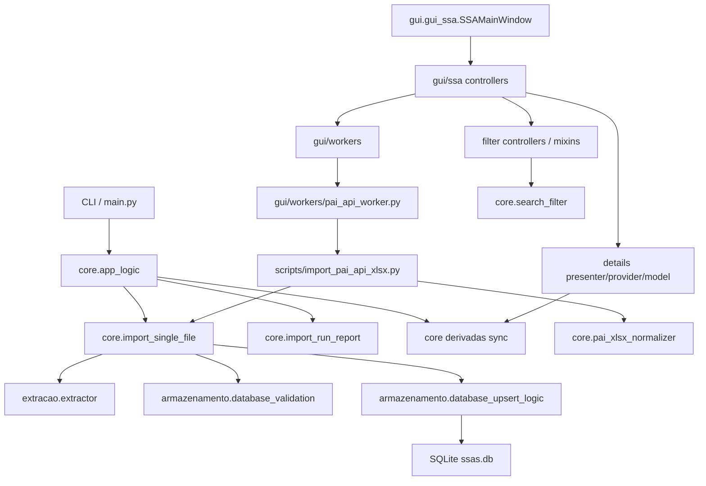
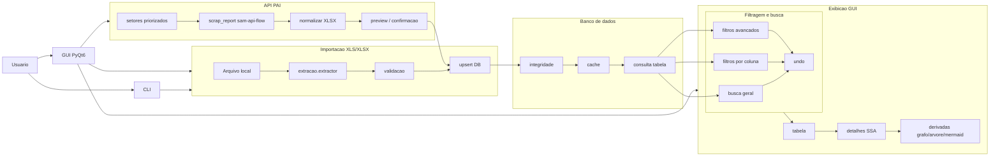

# Merge Readiness Architecture

## CURRENT TRUTH (2026-09-08, v4.50)

- Runtime e fontes: `v4.50`, branch `dev`. Tag anterior publicada: `v4.46`.
- Neste checkout, `origin` busca no GitHub principal e publica no GitHub principal, GitHub `schottge-menon` e GitLab. `gitlab` e `schottge` sao remotos dedicados.
- O usuario autorizou `git push` sem parametros. Os tres destinos foram conferidos por `git ls-remote`; tags exigem publicacao separada.
- Notas: `docs/RELEASE_NOTES_v4.50.md`. Evidencias e pendencias: `docs/CONTROLE_CORRECOES_REVISAO_2026_09_08.md`.
- Esta rodada publica fontes. Nao gerou binarios ou instaladores novos, nem validou artefatos Windows/Linux.
- GUI real exercitada no macOS. Retestes finais interrompidos por pedido do usuario; nao declarar esses retestes aprovados.
- CI remoto nao foi confirmado. Clawpatch teve HTTP 429; auditoria de dependencias possui pendencias registradas.
- `main` nao foi mesclado nesta rodada. O PR #121 ja estava mesclado; outro PR alvo ainda nao foi identificado.

## HISTORICAL SNAPSHOT 2026-05-20 23h14

- Branch alvo: `dev`.
- Baseline usado para este DOC_SYNC:
  - `2b8746564f64a11bf93fc70f030239260ec53059 2026-05-20 22:46:32 -0300 DOC_SYNC: update merge readiness handoff`.
- Este documento e documentacao apenas; confirmar o head operacional real com `git log -1`.
- Este documento e um mapa de revisao para PR/merge; nao substitui o estado real do PR/checks.

## Function Map

## Functionality Map

## Merge Readiness Gates

- Verde no baseline `2b874656`: `minimal-ci`, `CodeQL`, `Secret Scan`, `Automatic Dependency Submission`; revalidar o head atual apos qualquer novo DOC_SYNC.
- Local verde no slice runtime mais recente: `py_compile`, `ruff`, `ty`, `pytest` focado, `bandit`, `semgrep`, `detect-secrets`, `gitleaks`.
- Ferramentas externas com limitacao:
  - `CodeRabbit` local timeoutou sem findings em duas tentativas.
  - `Clawpatch` corrigiu achados reais aplicaveis, mas a revisao completa ainda teve timeout/provider.
  - `Qwen` headless foi validado com `glm-5-turbo`; modelos `qwen3.x` e `glm-5` ainda dependem de estabilidade do plano/modelo.

## Known Residuals

- `gui/mixins/filter_gui_ssa_mixin.py` ainda esta acima da meta de tamanho.
- `gui/gui_ssa.py` ainda e god class medio/alto, embora menor que ciclos anteriores.
- `tests/test_gui_filter_logic.py` ainda e arquivo de teste monolitico.
- `DatabaseAnalyzer` ainda mistura estrutura, sanidade de dominio e relatorio Markdown.
- Build/smoke macOS ainda nao foi executado neste ciclo; e bloqueante somente para release de artefato.
