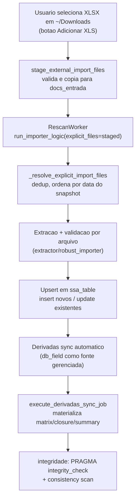
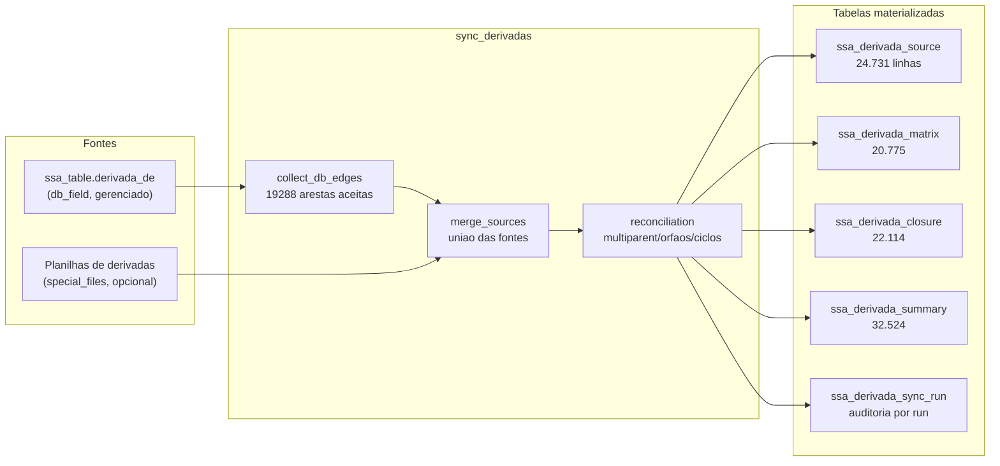
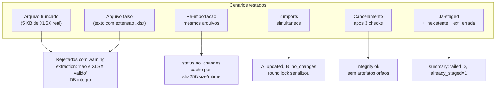
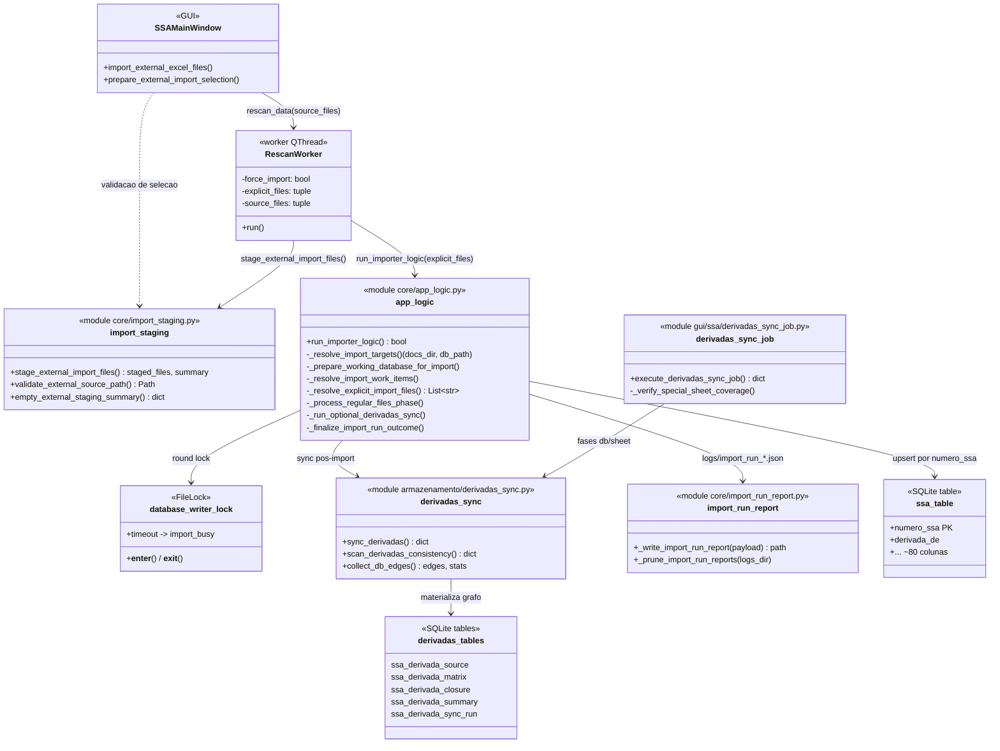

# Teste Real de Importacao e Sincronizacao de Derivadas

Documento do processo de validacao pesada executado em 2026-09-16 com
planilhas XLSX reais da pasta `~/Downloads`, exercitando o fluxo do botao
"Adicionar XLS" da GUI de ponta a ponta, sem tocar o banco de producao.

## Objetivo

Verificar com dados reais que o pipeline completo funciona:

1. Staging de arquivos externos (o que o botao "Adicionar XLS" faz).
2. Importacao explicita das planilhas staged.
3. Sincronizacao de derivadas (automatica no import + explicita).
4. Comportamento sob condicoes adversas: re-importacao, arquivos
   corrompidos, concorrencia, cancelamento.
5. Integridade do banco em todas as etapas.

## Ambiente de teste

Para nao modificar `data/ssas.db` de producao, foi montado um ambiente
isolado com uma copia real do banco:

```
/tmp/ssa_real_test/
  docs_entrada/   <- planilhas reais copiadas de ~/Downloads
  data/
    ssas.db       <- copia do banco de producao (134 MB, 99.538 SSAs)
/tmp/ssa_real_test2/  (mesma estrutura, segunda bateria)
```

A variavel `SSA_EXTRA_ALLOWED_PATHS=/tmp/ssa_real_test` libera os caminhos
de teste no guarda de paths (`utils/path_safety.py`).

Banco de producao preservado (verificado ao final):

- `data/ssas.db` mtime inalterado (Sep 11), `ssa_table` = 99.538 linhas,
  `max(sync_run_id)` = 52.

## Diagrama do fluxo exercitado



## Arquivos reais utilizados

| Arquivo | Linhas | Derivadas preenchidas |
|---|---|---|
| `Em Execucao_10-09-2026_1126AM.xlsx` | 693 | 134 |
| `Em Execucao_11-09-2026_0435PM.xlsx` | 680 | 128 |
| `Pendentes de Execucao_11-09-2026_0435PM.xlsx` | 734 | 166 |
| `Pendentes de Planejamento_11-09-2026_0435PM.xlsx` | 55 | 6 |
| `Consulta SSA - 14-01-2026_1204PM.xlsx` | (formato livre) | — |
| `Em Execucao_14-07-2026_1041AM.xlsx` | — | — |
| `Pendentes de Planejamento_14-07-2026_0916AM.xlsx` | — | — |
| `Consulta SSA - 16-01-2026_0519PM.xlsx` | — | — |
| `Em Execucao_26-06-2026_0532PM.xlsx` | — | — |
| `Pendentes de Programar_14-07-2026_0917AM.xlsx` | — | — |

Uniao das 4 primeiras: 1.550 SSAs distintos, todos ja presentes no banco
de producao (o banco foi alimentado por snapshots desse mesmo conjunto).

## Etapa 1 — Staging ("Adicionar XLS")

```python
staged, summary = stage_external_import_files(
    project_root='/tmp/ssa_real_test2',
    docs_dir='/tmp/ssa_real_test2/docs_entrada',
    source_files=[<3 arquivos reais de Downloads>],
)
```

Resultado:

```
staged:  ['Em Execucao_14-07-2026_1041AM.xlsx',
          'Pendentes de Planejamento_14-07-2026_0916AM.xlsx',
          'Consulta SSA - 14-01-2026_1204PM.xlsx']
summary: {'copied': 3, 'skipped': 0, 'failed': 0,
          'unsupported': 0, 'staged': 3, 'already_staged': 0}
```

Caso misto (valido + inexistente + extensao errada + ja-staged):

```
summary: {'copied': 1, 'skipped': 0, 'failed': 2,
          'unsupported': 0, 'staged': 2, 'already_staged': 1}
```

Observacao menor: arquivo ja-staged aparece duplicado na lista `staged`
retornada (`staged: 2` com `already_staged: 1`). Inofensivo porque
`_resolve_explicit_import_files` deduplica por path normalizado, mas o
caller ve a lista com duplicata.

## Etapa 2 — Importacao explicita

```python
run_importer_logic(
    docs_dir=..., data_dir=..., db_name='ssas.db',
    table_name='ssa_table', force_import=False,
    explicit_files=tuple(staged),
    extra_allowed_roots=('/tmp/ssa_real_test2',),
)
```

### Resultados por rodada

| Rodada | Arquivos | Status | Detalhe |
|---|---|---|---|
| 4 XLSX set/2026 | 4 | `updated` | 2162 linhas extraidas/inseridas; **1468 SSAs atualizados**; 0 erros |
| Mesmos 4 (re-run) | 0 | `no_changes` | Cache: `no_new_or_modified_files`; 2,3 s |
| Consulta SSA 14-01 | 1 | `updated` | **+1 SSA inserido** (formato livre parseou) |
| 3 staged (jul/2026) | 3 | `updated` | +2 insercoes, 5 updates |
| 2 corrompidos | 2 | `False` | Rejeitados com warning "nao e XLSX valido"; DB intacto |
| Concorrencia (2 threads) | — | A=`updated`, B=`no_changes` | Sem corrupcao; lock serializou |
| Cancelamento (apos 3 checks) | — | `False` | DB integro; **zero artefatos orfaos** |

### Evidencia do relatorio de run (`logs/import_run_*.json`)

Primeira rodada (4 arquivos):

```json
{
  "status": "updated",
  "reason": "files_processed_or_cache_updated",
  "counts": {
    "success_count": 4,
    "error_count": 0,
    "rows_extracted_total": 2162,
    "rows_inserted_total": 2162,
    "ssa_inserted_total": 0,
    "ssa_updated_total": 1468,
    "sync_materialized": true
  },
  "durations": { "run_file_processing_seconds": 4.549 }
}
```

Re-importacao dos mesmos arquivos (cache hit):

```json
{
  "status": "no_changes",
  "reason": "no_new_or_modified_files",
  "counts": { "total_candidates": 0 }
}
```

`result: false` aqui significa "nada mudou", nao falha — o status
`no_changes` e o indicador correto.

## Etapa 3 — Sincronizacao de derivadas

### 3a. Automatica (durante a importacao)

O import materializou o grafo (run 53):

```
sync_run_id=53  status=ok  db_edges=19287  active_edges=19370
conflict_count=0  multiparent=26  orphan_parent=2  cycle_node=0
```

### 3b. Explicita (`sync_derivadas`, db-only)

```python
sync_derivadas(db_path, table_name='ssa_table',
               include_db_source=True, extra_allowed_roots=...)
```

```
db_stats.accepted_edges = 19288
merged_edges = 19288   active_edges = 19371
reconciliation: multiparent=26, orphan_parents=2,
                orphan_children=0, conflicts=0, cycles=0
integrity_check.is_consistent = True
todos os issue_counts = 0
```

### 3c. Via job da GUI (`execute_derivadas_sync_job`)

```
ok = True
db_edges = 19287   sheet_edges = 0   merged_edges = 19370
consistency.is_consistent = True
issue_counts = {missing_source_pairs: 0, source_without_matrix: 0,
                flag_mismatch: 0, invalid_matrix: 0,
                closure_self_rows: 0, summary_missing_nodes: 0,
                summary_extra_nodes: 0, fingerprint_mismatch: 0}
```

### Diagrama da materializacao de derivadas



### Spot-check manual (planilha -> banco -> grafo)

| Planilha (`Derivada de` -> `Numero da SSA`) | `ssa_table.derivada_de` | `ssa_derivada_source` |
|---|---|---|
| 202519653 -> 202600800 | `202600800 / 202519653` | aresta ativa `is_active=1` |
| 202506591 -> 202603876 | `202603876 / 202506591` | ativa + historico `202503884` inativo |
| 202506591 -> 202603879 | `202603879 / 202506591` | ativa + historico `202503884` inativo |

Historico multiparent preservado: arestas antigas ficam com
`is_active=0, source_flag=2` em vez de serem apagadas.

## Condicoes adversas verificadas



## Integridade

- `PRAGMA integrity_check` = `ok` em todas as rodadas, inclusive
  pos-cancelamento e pos-corrompidos.
- `PRAGMA foreign_key_check` = 0 violacoes.
- Sem sidecars `-wal` / `-shm` / `-journal` orfaos em `data/`.
- Sem candidatos `full_rescan_candidate_*` residuais (modo diff nao os
  cria; ver `CRIACAO_DB_DO_ZERO.md` para o modo que cria).

## Diagrama de classes (UML)

Versao editavel em draw.io: `docs/diagrams/importacao_derivadas_classes.drawio`.



## Arquivos de codigo envolvidos

| Papel | Arquivo |
|---|---|
| Botao "Adicionar XLS" | `gui/gui_ssa.py` (`import_external_excel_files`) |
| Staging de externos | `core/import_staging.py` (`stage_external_import_files`) |
| Worker da GUI | `gui/workers/rescan_worker.py` |
| Orquestracao do import | `core/app_logic.py` (`run_importer_logic`) |
| Resolver explicitos | `core/app_logic.py` (`_resolve_explicit_import_files`) |
| Sync de derivadas | `armazenamento/derivadas_sync.py` (`sync_derivadas`) |
| Job de derivadas da GUI | `gui/ssa/derivadas_sync_job.py` (`execute_derivadas_sync_job`) |
| Relatorio de run | `core/import_run_report.py` (`logs/import_run_*.json`) |

## Veredito

Pipeline saudavel com dados de producao: staging, import, dedup via
cache, sync de derivadas, concorrencia, cancelamento e rejeicao de
corrompidos comportam-se corretamente. Unico ponto observavel e
cosmetico (duplicata na lista `staged` retornada por
`stage_external_import_files`, inofensiva pela dedup downstream).
