# Arquitetura de Workers - Diagrama de Sequência e Fluxo

## Diagrama de Sequência - Carregamento e Filtragem

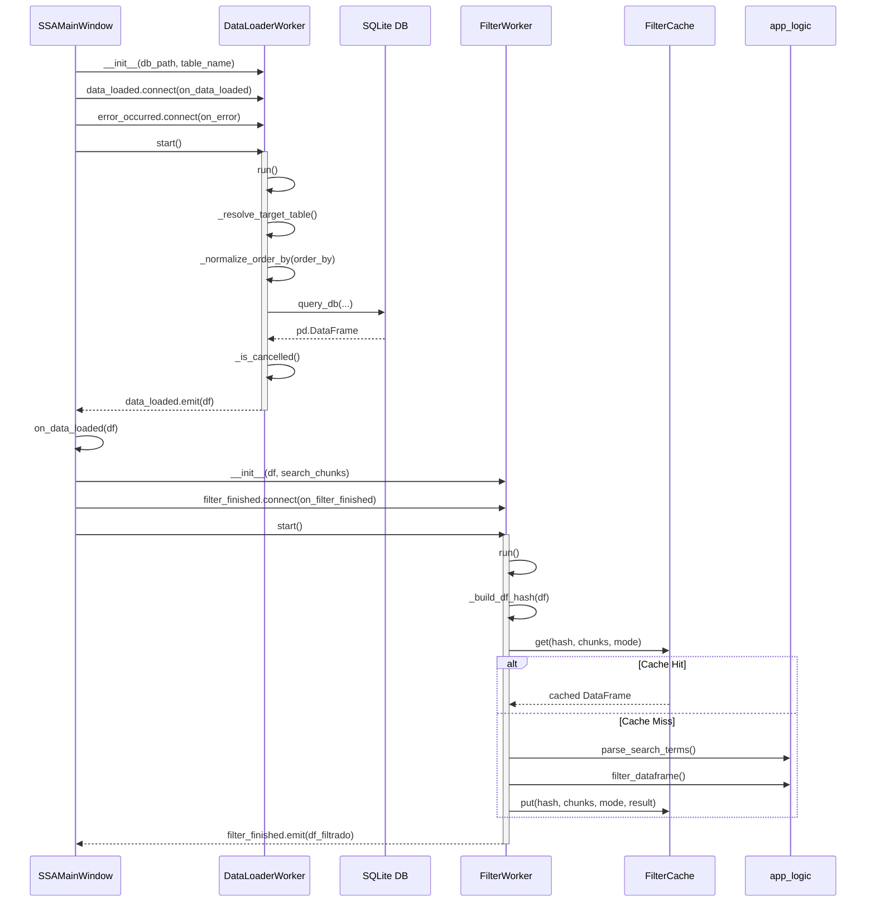

## Diagrama de Classes

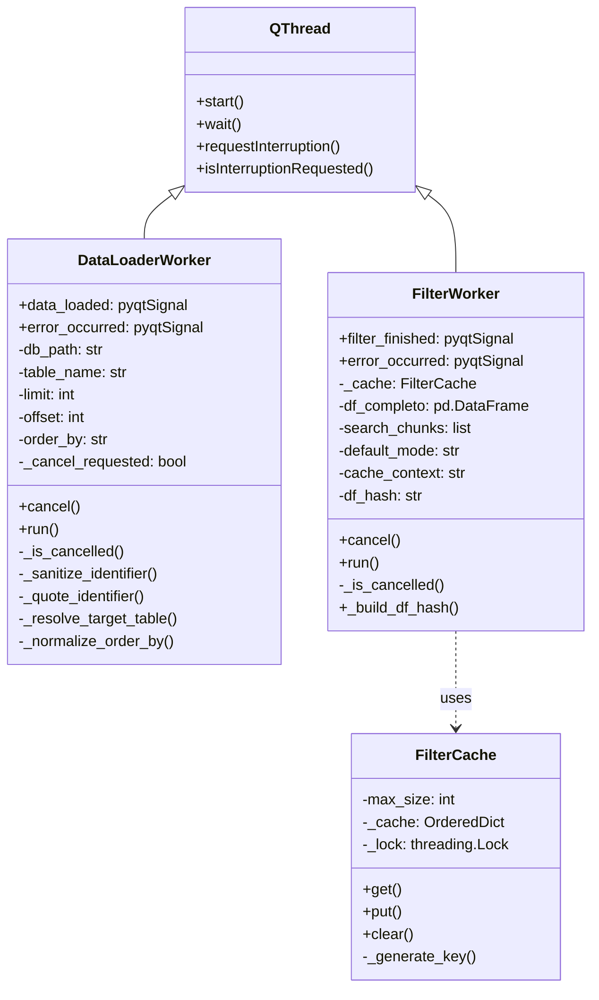

## Fluxograma - Algoritmo de Hash do FilterWorker

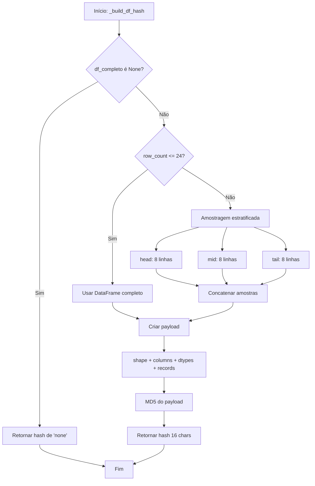

## Fluxograma - Cancelamento Seguro

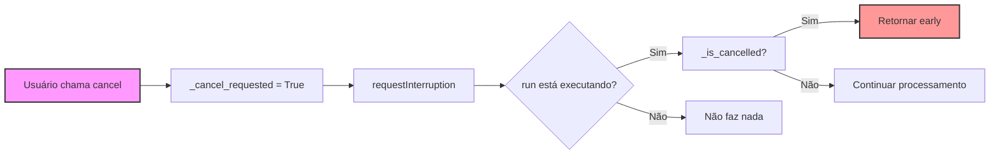

## Diagrama de Estados - DataLoaderWorker

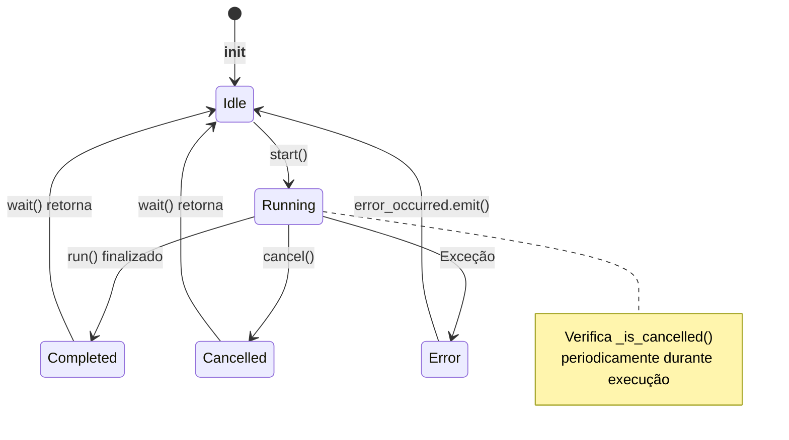

## Mapa de Cache LRU

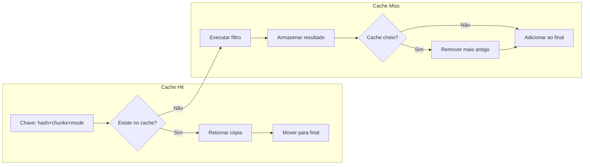

## Arquitetura de Threads

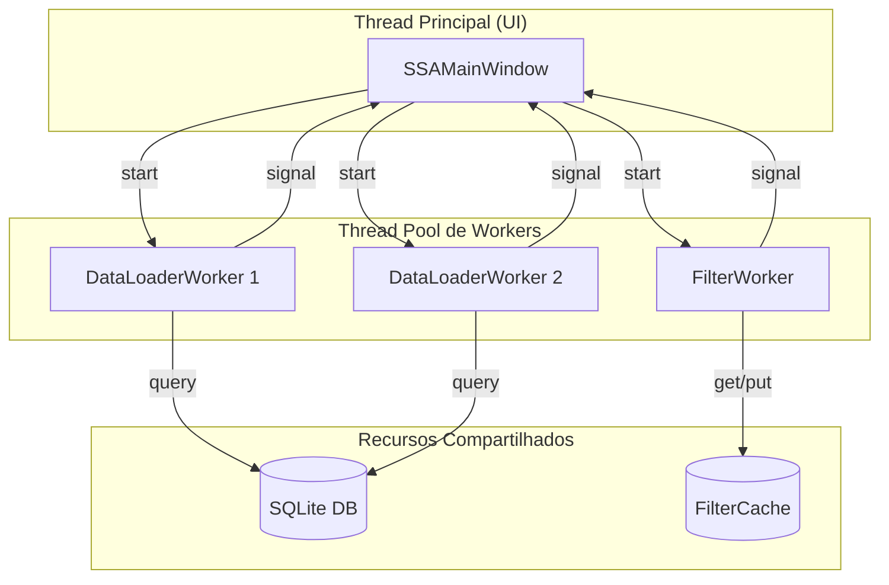

## Casos de Uso

### Caso 1: Carregamento Normal
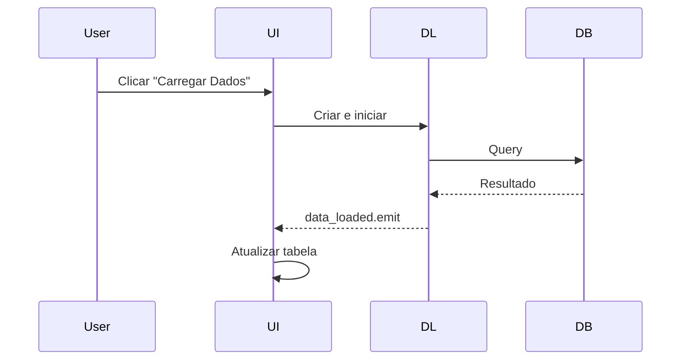

### Caso 2: Cancelamento
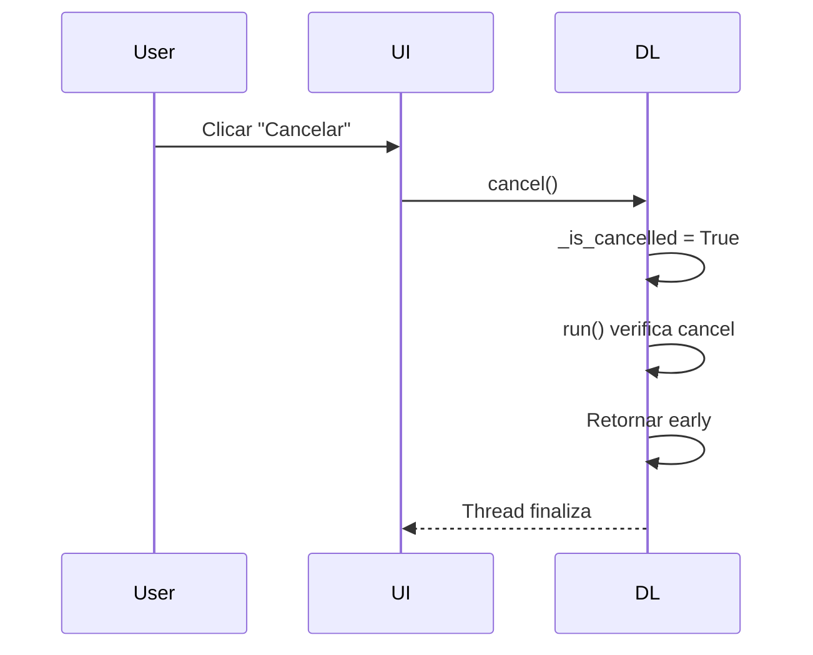

### Caso 3: Cache Hit
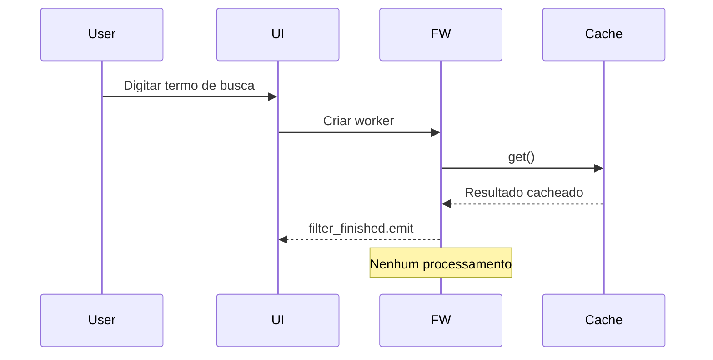

### Caso 4: Cache Miss
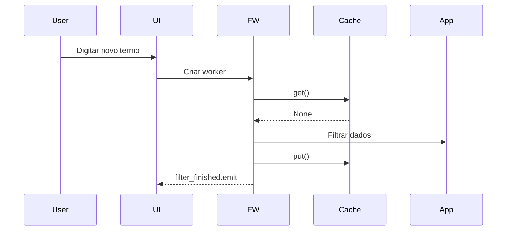

<!-- DOC_SYNC_MAC: 2026-03-29 host-agnostic paths, continue from repo root on macOS -->

